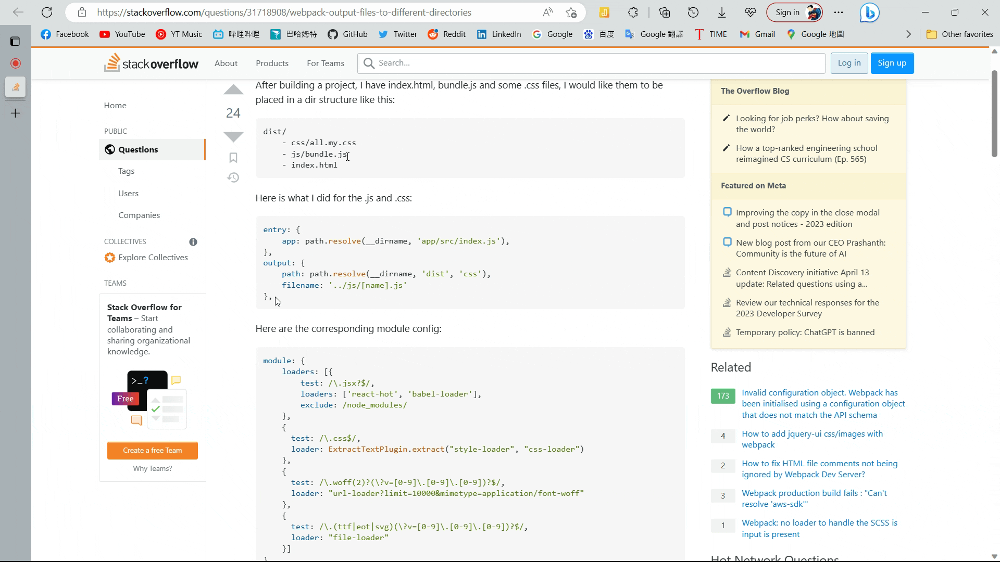
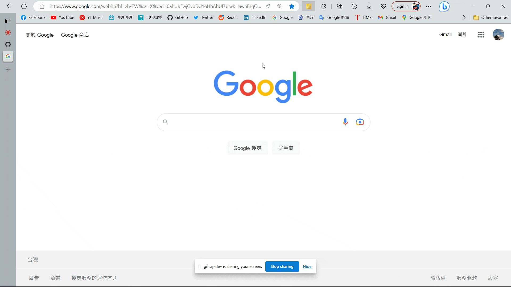
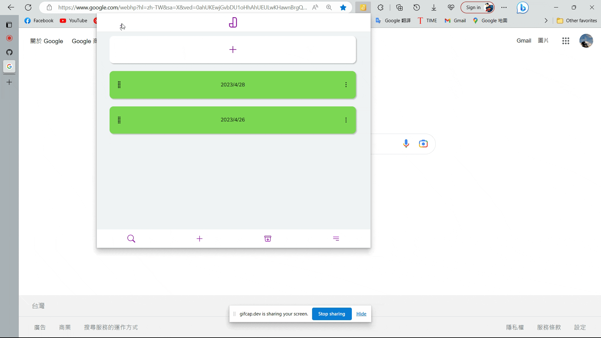

## Jutten介紹


如果你需要一個可以隨時快速筆記，快速把中意的句子或文章記錄起來，或是 此為 Chrome Extension 的筆記軟體 目前正在開發中，版本 0.17.0 預計未來上架 Chrome Extension

### 隨時記錄

隨時把所需的文字加入至 Juuten 




### 隨時筆記

可以隨時記錄你所想的東西



### 自由的創建編輯和排序

照你所想自由地進行分類和排序



## 使用技術

+ `React` 前端框架
+ `Redux` 狀態管理
+ `React Router` 路由工具
+ `styled-components` css-in-js
+ `Redux-Thunk` 處理非同步狀態
+ `Draftjs` 筆記文本編輯器
+ `React-beautiful-dnd` dnd(托移)組件
+ `webpack` 打包整合工具

## 代碼簡介

### Draft.js

使用 Draft 創立組件後利用 `forwardRef` 配合 `useImperativeHandle` 將函數和變數向前傳送，讓父組件也能使用，之後要新增函數或進行改動也相當容易

```jsx
/* DraftComponent.jsx */
const DraftComponent = memo(forwardRef((
    {
        item = '',
        readOnly = false,
        setInlineStyle,
        open = false,
        autoSave = {}
    },
    ref
) => {
    const mainRef = useRef(null)
    const [editorState, setEditorState] = useState(() => {
        if (item) return EditorState.createWithContent(convertFromRaw(JSON.parse(item)))
        else return EditorState.createEmpty()
    })

    function onChange(state) {
        setEditorState(state)
    }

    useImperativeHandle(
        ref,
        () => ({
            editorState: editorState,
            toggleStyle: (style, e) => {
                e.preventDefault()
                const newState = RichUtils.toggleInlineStyle(editorState, style)
                nowInlineStyle(newState)
                onChange(newState)
            },
            autoFocus: () => {
                onChange(EditorState.moveFocusToEnd(editorState))
            },
        }),
        [editorState]
    )
    return (
        <Editor
            editorState={editorState}
            onChange={onChange}
            ref={mainRef}
        />
    );
}))

```

### React Thunk

使用`React  Thunk` 獲取 `Chrome sync` 的資料後使用回調進行畫面跳轉

```javascript
/* FolderBlock.jsx */
function goIntoFolder(e, item) {
    e.stopPropagation()
    const fn = () => navigate(`/collection/${item.key}`)
    dispatch(addFetchData({
        item,
        fn,
    }))
}

/* collectionSlice.js */
const thunkData = createAsyncThunk(
    'folder/fetchFolderData',
    async ({item, fn}) => {
        const value = await fetchData(item.key, [])
        return {item, value, fn}
    })
export const CollectionSlice = createSlice({
    name: 'collection',
    initialState: {/* ... */},
    reducers: {/* ... */},
    extraReducers: {
        [thunkData.fulfilled]: (state, action) => {
            const {
                item, value, fn = () => {
                }
            } = action.payload
            fn()
            return {
                ...state,
                folderData: item,
                [item.key]: value
            }
        },
    },
})
```

### Search Note
在所有的筆記內查找是否有符合輸入的文字，如果有把所有相同的文字打上 Highlight
```javascript
/* FoundData.jsx */
function findData() {
    const target = inputRef.current?.value.toUpperCase()
    if (!target) {
        setFoundData([])
        return
    }
    const newData = data
        .map(item => {
            // 先篩選符合條件的註解(comment)，並加上 highlight 的樣式
            const comment = item.comment
                .filter(item2 => isMsgHas(item2.msg, target))
                .map(comm => ({...comm, msg: highlightMsg(comm.msg, target)}))

            // 如果主要文字也符合搜尋條件，也要加上 highlight 的樣式
            const _data = {
                ...item,
                comment: comment,
                msg: isMsgHas(item.msg, target)
                    ? highlightMsg(item.msg, target)
                    : (comment.length ? highlightMsg(item.msg, target) : '')
            }
            // 排除沒有搜尋結果的資料
            return (!!_data.msg || !!_data.comment.length) ? _data : null
        })
        .filter(item => item !== null)
        // 將結果依照資料夾分類
        .reduce((outputObject, {folderName, ...rest}) => {
            if (!outputObject[folderName]) outputObject[folderName] = []
            outputObject[folderName].push({...rest})
            return outputObject
        }, {})
    // 更新搜尋結果
    setFoundData(newData)
}

function isMsgHas(msg, target) {
    /**
     * 檢查 `msg` 是否包含 `target` 字符串
     * @param {string} msg - 要檢查的消息
     * @param {string} target - 要搜索的目標字符串
     * @returns {boolean} - 如果 `msg` 包含 `target` 字符串，返回 `true`；否則，返回 `false`
     */
    const contentState = convertFromRaw(JSON.parse(msg))
    const plainText = contentState.getPlainText().toUpperCase()
    return plainText.includes(target)
}

function highlightMsg(msg, target) {
    /**
     * 將給定的消息中的目標文本高亮
     * @param {string} msg - 原始訊息
     * @param {string} target - 要高亮的目標文本
     * @returns {string} JSON格式的高亮消息
     */
    let editorState = EditorState.createWithContent(convertFromRaw(JSON.parse(msg)))
    const blocks = editorState.getCurrentContent().getBlockMap()
    const regex = new RegExp(target, 'g')

    // 每個Block檢測是否有相同文字，如果有打上Highlight
    blocks.forEach(block => {
        const text = block.getText().toUpperCase()
        let matchArr = regex.exec(text)
        while (matchArr !== null) {
            editorState = RichUtils.toggleInlineStyle(
                EditorState.forceSelection(
                    editorState,
                    editorState.getSelection().merge({
                        anchorKey: block.getKey(),
                        focusKey: block.getKey(),
                        anchorOffset: matchArr.index,
                        focusOffset: matchArr.index + target.length,
                    })),
                'HIGHLIGHT'
            )
            matchArr = regex.exec(text)
        }
    })
    return JSON.stringify(convertToRaw(editorState.getCurrentContent()))
}
```

## 聲明

此軟體完全由 Zeke 進行開發 如有 Bug 歡迎通知我

Github: [Zeke](https://github.com/JikeLuo)

E-Mail: traveller87072@gmail.com


